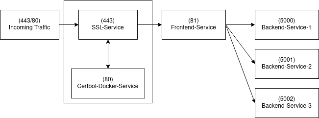

# ssl-certificate-docker-service


A standalone docker ssl service. It can be attached to the regular front-end application through port 81.

## Overview


## How to use it

1. Add the two services `ssl-service` and `certbot` to your docker-compose file.

```yaml
  ssl-service:
    image: europe-west6-docker.pkg.dev/mtc-dev/mtc-ethz/ssl-service:latest
    ports:
      - 443:443
    volumes:
      - "letsencrypt:/etc/letsencrypt"
      - "var_letsencrypt:/var/lib/letsencrypt"
    env_file:
      - .env
    restart: unless-stopped

  certbot:
    image: certbot/certbot
    command: certonly -n --standalone --agree-tos --email ${SSL_EMAIL:?err} -d
      ${BASE_URL:?err} -d www.${BASE_URL:?err}
    ports:
      - 80:80
    volumes:
      - "letsencrypt:/etc/letsencrypt"
  frontend:
    restart: unless-stopped

volumes:
  letsencrypt: {}
  var_letsencrypt: {}
```

2. Add the ssl-variables to your `.env`-file or copy the existing one. Obviously adjust them to your website.
```conf
##### SSL ENV VARIABLES ###### 
BASE_URL = test-dev.mediatechnologycenter.ch
SSL_EMAIL = mtc@inf.ethz.ch
FRONTEND_URL = http://frontend:80
```
3. Run `docker-compose up --build`.
4. Enjoy!
5. If you would like to run it without ssl use a second docker-compose file. e.g. docker-compose.dev.yml.
   You can run it with `docker-compose up -f docker-compose.yml -f docker-compose.dev.yml`
```yml
  ssl-service:
    profiles:
        - disabled
  certbot:
    profiles:
        - disabled
  frontend:
    ports:
      - 3000:3000 # Example dev port
  # Add your dev configuration here
```

